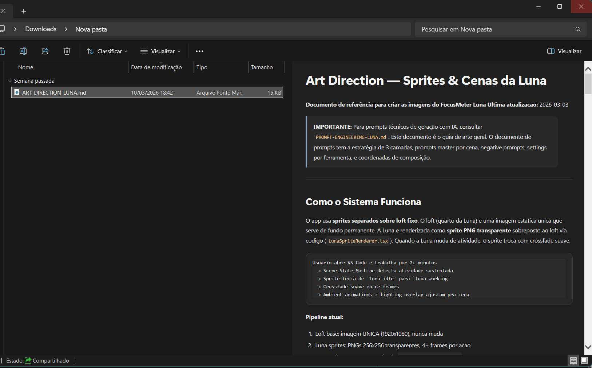

# MdExplorerPreview

Preview handler para arquivos Markdown no Preview Pane do Windows Explorer.

O projeto instala duas coisas:

- um preview handler para `.md` e variantes;
- um auto-unblocker leve para pastas confiaveis, focado em `Downloads`.

## O que o produto resolve

Quando um arquivo Markdown chega com `Zone.Identifier`, o Explorer pode bloquear o preview.

Este projeto resolve isso em duas camadas:

- renderiza Markdown no Preview Pane sem trocar o aplicativo padrao do `.md`;
- remove automaticamente o bloqueio de origem para tipos seguros em pastas confiaveis configuradas.

## Instalacao para usuario final

O fluxo recomendado para distribuicao e:

1. baixar o `MdExplorerPreview.Setup.msi` pela GitHub Release;
2. executar o instalador como administrador;
3. abrir o Explorer;
4. ativar o Preview Pane;
5. selecionar um arquivo `.md`.

## O que entra no MSI

- preview handler do Windows Explorer
- auto-unblocker em background
- configuracao de inicializacao por sessao
- registro e remocao do handler

## O que nao entra no repositorio como artefato

O repositorio guarda fonte, scripts e docs.

O instalador `.msi` deve ser publicado em GitHub Releases, nao versionado no codigo-fonte.

## Documentacao

- instalacao e empacotamento: [MSI-PACKAGING.md](docs/MSI-PACKAGING.md)
- GitHub e distribuicao: [GITHUB-PUBLISHING.md](docs/GITHUB-PUBLISHING.md)
- fluxo de release: [RELEASING.md](docs/RELEASING.md)
- auto-unblocker: [AUTO-UNBLOCKER.md](docs/AUTO-UNBLOCKER.md)
- validacao: [VALIDATION-MATRIX.md](docs/VALIDATION-MATRIX.md)
- arquitetura e manutencao: [IMPLEMENTACAO.md](IMPLEMENTACAO.md)

## Para desenvolvimento e laboratorio

Os bootstraps `.cmd` continuam no projeto, mas ficaram agrupados em:

- [scripts/bootstrap](scripts/bootstrap)

Eles existem para manutencao, validacao local e laboratorio. Nao sao a entrada principal para usuario final.

## Licenca

MIT. Veja [LICENSE](LICENSE).
