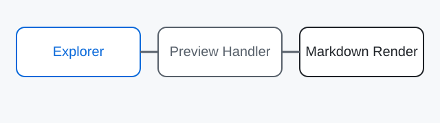

# Preview Fixture

Este arquivo existe para validar o handler no Preview Pane do Windows Explorer.

---

## Headings e listas

- item 1
- item 2
  - item 2.1
  - item 2.2

1. primeiro
2. segundo
3. terceiro

## Blockquote

> O preview deve ser somente leitura, estável e rápido.

## Código

```powershell
Get-ChildItem .\samples -Recurse -Filter *.md
```

## Tabela

| Campo | Esperado |
| --- | --- |
| Headings | Sim |
| Listas | Sim |
| Código | Sim |
| Tabelas | Sim |
| Blockquotes | Sim |
| Links | Sem navegação |
| Imagens locais | Quando o caminho existir |

## Links

[OpenAI](https://openai.com/) deve aparecer como link, mas o clique não deve navegar no Preview Pane.

## Imagem local


